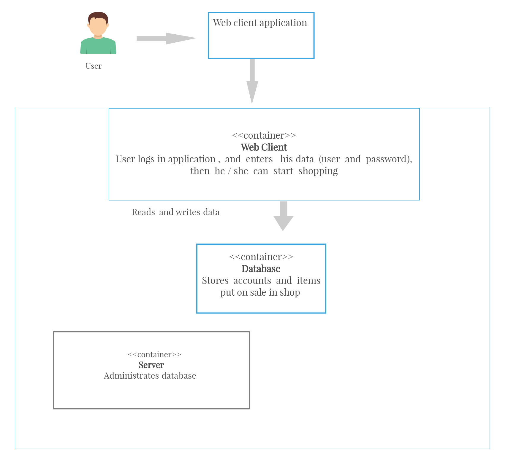

# Music Shop App

## Structure
The project is structured in 3 parts:
- client - user logs in and shops items
- database - storing user accounts and items
- server - administrates database

## Client
How to run client?
1) Build container: `docker build -t client client` (from root folder of the project)
2) Run container: `docker container run -p 8888:5000 client`
3) Access page at http://127.0.0.1:8888/

## Server

## Database